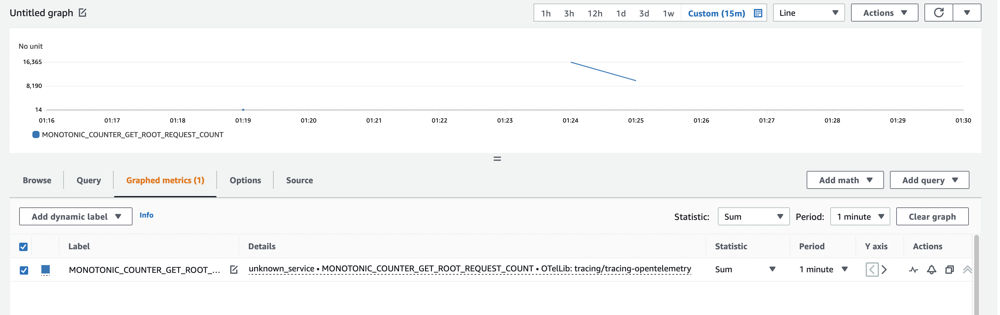

# Tracing Metrics Feature Test

This project is to try out the following branch of `tracing`:
https://github.com/bryangarza/tracing/tree/opentelemetry-metrics

Clone this project and my fork/branch of tracing, and `cargo run`.

OTel setup originally from https://github.com/tokio-rs/mini-redis.

To send metrics to CloudWatch, you will need to have a copy of AWSOtelCollector
running on the same host.

For demo purposes, you can follow the setup documented at
https://github.com/aws-observability/aws-otel-collector/blob/main/docs/developers/docker-demo.md#run-a-single-aws-otel-collector-instance-in-docker